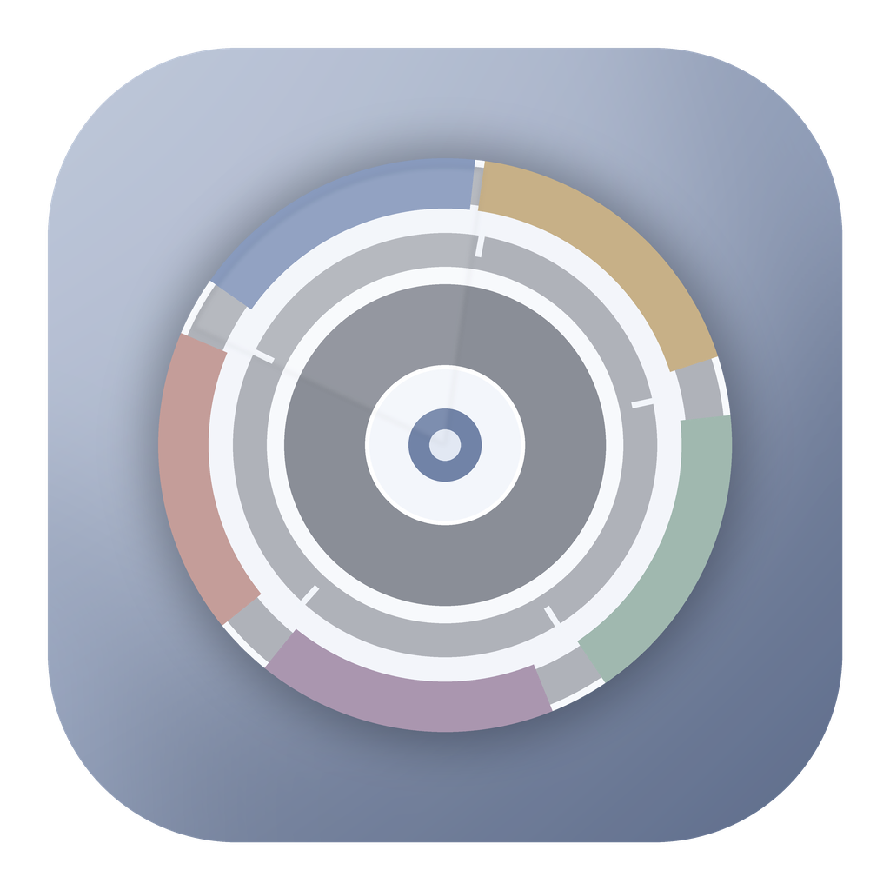

<p align="center">
  
</p>

# MacStorageLens（磁碟透視）

**原生 SwiftUI macOS 儲存空間分析與安全分級清理工具。**

MacStorageLens 把 APFS/磁碟容量帳務、可遍歷資料樹、未解析空間差額與清理候選分開呈現；清理採白名單規則、風險分級、使用者明確選取與執行前重新驗證，不把「看不懂的系統資料」直接當成垃圾。

- **版本**：1.7.5（Build 33）
- **Scanner**：2.5.3
- **最低系統**：macOS 14
- **開發者 / Author**：**Jason Chen**
- **授權**：MIT

## 主要功能

- APFS / volume / free-space / directory-tree 容量分析與 Markdown 報告。
- 容量總覽、資料樹與可鑽取 Sunburst 視覺化。
- 六級安全清理：超級保守、保守、平衡、激進、超激進、自定義。
- Finder 可見垃圾桶與「直接徹底刪除」兩條明確執行路徑。
- 外接磁碟、SD/USB 與部分 NAS/遠端掛載的 capability-aware 行為。
- AppleDouble、App cache、開發工具 cache、package-manager cache、App leftovers、logs/diagnostics 等受控規則。
- 高風險資料、廢紙簍永久清空、系統管理項目均需額外明確啟用；不會因升級偷偷加入既有偏好。
- 清理前 live revalidation；掃描結果本身不是刪除授權。

## 快速開始

### 建立原生 App

Finder 中雙擊：

```text
scripts/建立並啟動.command
```

腳本會以 SwiftPM release 模式建立：

```text
dist/MacStorageLens.app
```

第一次使用完整系統掃描時，macOS 可能要求「完整磁碟存取權」或外接卷宗權限。請只授予你確實需要的權限。

### 直接執行開發版

```bash
swift run MacStorageLens
```

或雙擊：

```text
scripts/只執行開發版.command
```

## 驗證

在 macOS 雙擊：

```text
scripts/驗證原始碼.command
```

驗證包含 package manifest、Swift parser/compiler regression、cleanup filesystem fixtures、UI/static contracts、增量索引、安全邊界與 macOS release build。跨平台可重跑的驗證原始碼保留在 `Verification/`；大量歷史產物與機器路徑輸出刻意未納入公開 repository。

## 專案結構

```text
MacStorageLens/
├── Sources/MacStorageLens/   # SwiftUI/AppKit app 與核心邏輯
├── Resources/                # Scanner scripts 與 App icon
├── Verification/             # 可重跑的 Swift/Python 驗證原始碼
├── ThirdParty/               # 第三方授權副本
├── scripts/                  # 建置、執行、驗證入口
├── docs/                     # 架構、安全清理與目前 release 文件
├── Package.swift
├── SECURITY.md
├── CHANGELOG.md
└── LICENSE
```

更完整架構請看 [`docs/ARCHITECTURE.md`](docs/ARCHITECTURE.md)。清理等級請看 [`docs/CLEANUP_PROFILE_REFERENCE.md`](docs/CLEANUP_PROFILE_REFERENCE.md)。

## 安全設計

MacStorageLens 不是「一鍵刪除器」。清理遵循以下原則：

1. 掃描、候選判定、實際刪除分層。
2. 高風險候選預設不選取。
3. 執行前重新驗證 path、類型、symlink/package、volume capability 等條件。
4. Finder Trash 與永久刪除不互相偷偷 fallback。
5. 永久刪除不等於安全覆寫或鑑識級抹除。

詳見 [`SECURITY.md`](SECURITY.md)。

## 1.7.5

1.7.5 把 MacSai source-reviewed 的 System Junk/Trash Bins 研究整合回既有六級模型，並將廢紙簍處理限制在目前 UID、明確外接卷宗範圍與 direct-only 高風險流程。完整 release notes：[`docs/release-notes/1.7.5.md`](docs/release-notes/1.7.5.md)。

## 第三方來源

部分垃圾判定規則研究參考 [MacSai](https://github.com/iliyami/MacSai)（BSD 3-Clause）。MacSai 原始碼不直接編譯進 MacStorageLens；來源追蹤與授權副本請看 [`THIRD_PARTY_NOTICES.md`](THIRD_PARTY_NOTICES.md) 與 `ThirdParty/MacSai-LICENSE.txt`。

## License

MacStorageLens © 2026 **Jason Chen**，依 [MIT License](LICENSE) 發布。第三方元件/研究來源依各自授權條款。
